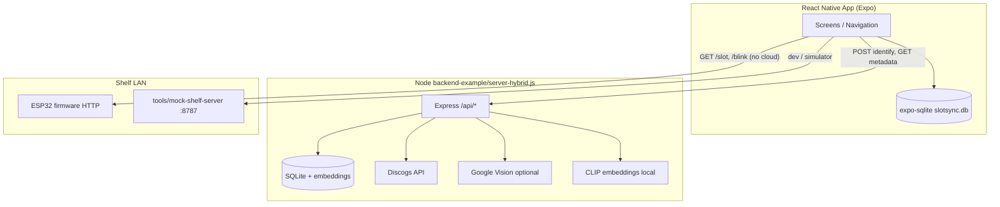
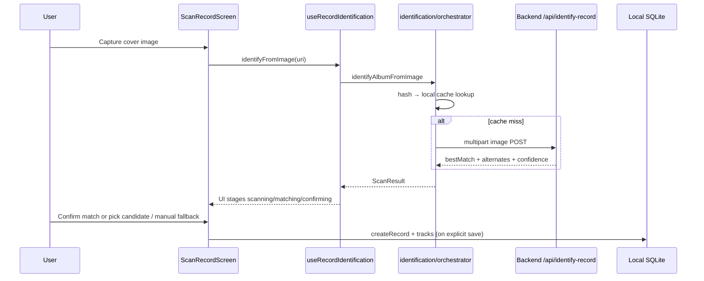
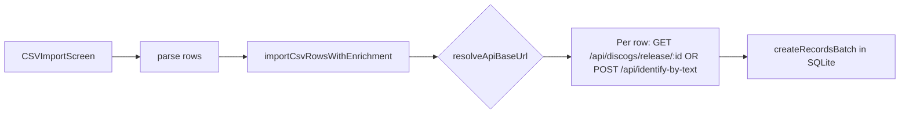
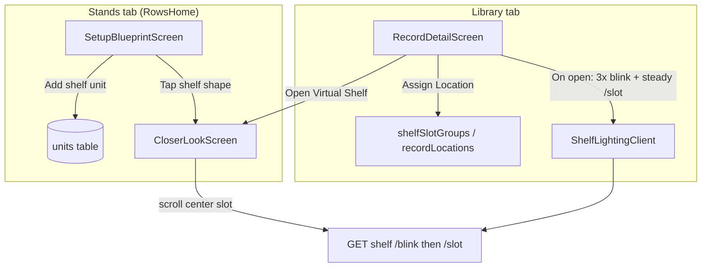
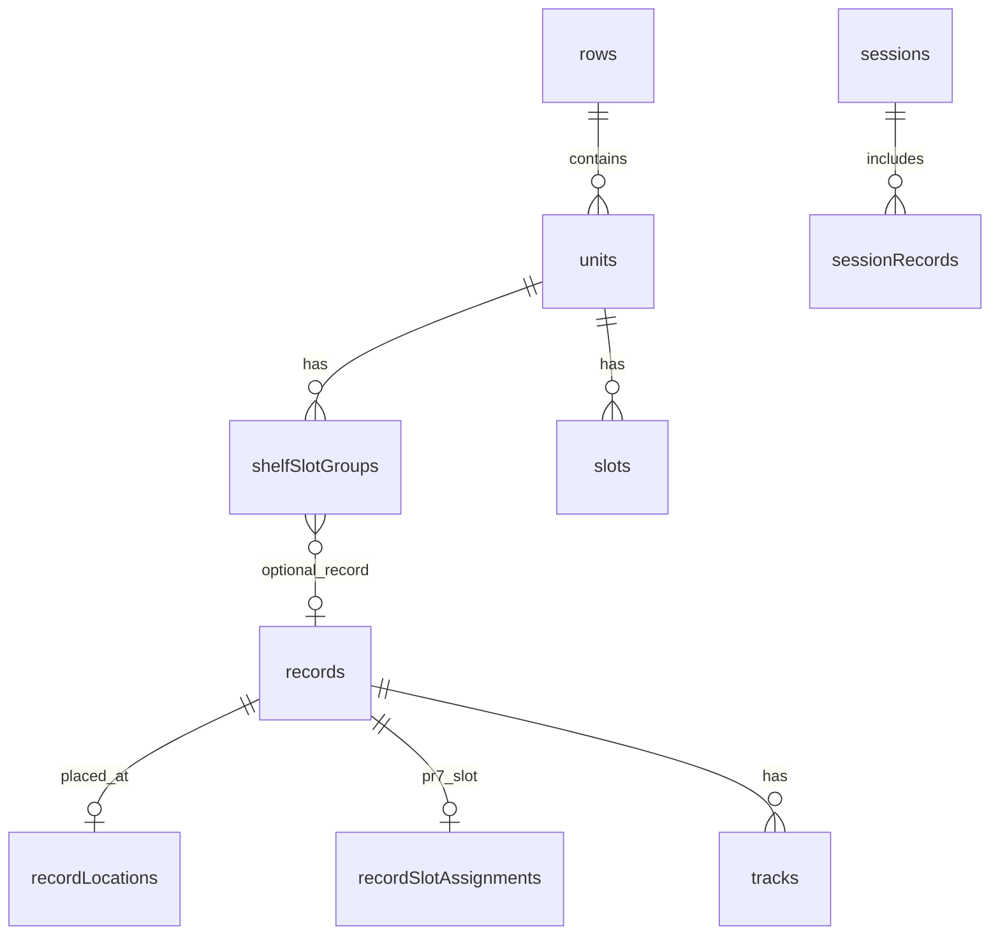
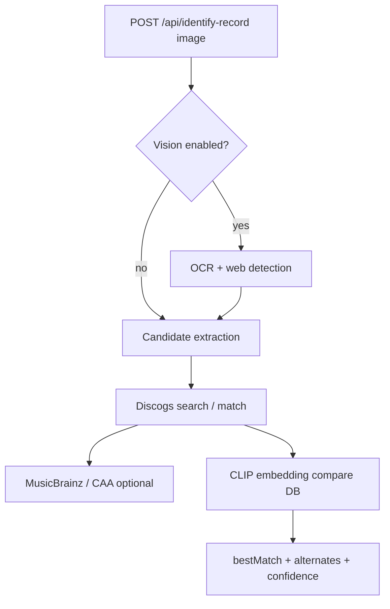
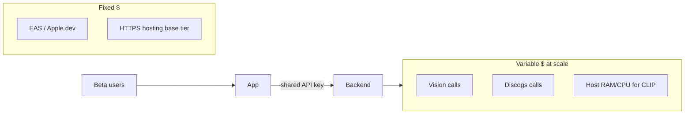

# SlotSync — Engineering Handoff (Senior Review)

**Audience:** Engineers new to the product and codebase.  
**Last updated:** 2026-05-01 (reflects private-beta trajectory: Expo app + hybrid Node backend + LAN shelf ESP32).

---

## How to use this document (reviewer map)

| You need | Go to |
|----------|--------|
| **What we are building & why** | [§1 Specific goals](#1-specific-goals--product-context) |
| **System architecture** (how components interact) | [§2 System architecture](#2-system-architecture) |
| **Key file map** (files → exact responsibilities) | [§3 Key file map](#3-key-file-map) |
| **Setup & dependencies** (install, configure, run) | [§4 Setup--dependencies](#4-setup--dependencies) |
| **Tech stack & versions** | [§5 Tech-stack--versions](#5-tech-stack--versions) |
| **Open issues & gotchas** | [§6 Open issues--gotchas](#6-open-issues--gotchas) |
| User journeys & flowcharts | [§7+](#7-core-user-journeys-end-to-end) |
| Cost / scale red flags | [§18](#18-red-flags--monetary--engineering-reviewer-priority) |
| Deep dive (data model, API, shelf) | [§9–§14](#9-local-data-model-sqlite-on-device) |

---

## 1. Specific goals & product context

**SlotSync** is a **React Native (Expo)** mobile app for **vinyl record collectors** who store records on **physical LED-equipped shelves**. The product closes a loop that Discogs-style apps do not:

1. **Identify** a record (camera, barcode, text, or CSV import).
2. **Catalog** it locally with metadata (artist, title, year, cover, tracklist).
3. **Assign** each record to a **logical shelf slot** (row → unit/shelf → slot number).
4. **Find** records physically via **shelf lighting** (highlight, blink, browse-by-slot in “Closer Look”).

The app treats the shelf as a **logical grid of slots (1…N)**. **Firmware** on an ESP32 maps odd/even LED strips to those slots; the mobile app never encodes strip wiring.

**Two separate networks:**

| Plane | Protocol | Purpose |
|-------|----------|---------|
| **Cloud / LAN backend** | HTTPS or `http://<LAN>:3000` | Identification, Discogs metadata, optional Vision + CLIP embeddings |
| **Shelf (LAN only)** | HTTP GET to ESP32 or mock server | LED control (`/slot`, `/blink`, `/status`, …) |

There is **no cloud shelf service** in beta; shelf control is **direct HTTP on the local Wi‑Fi** (or `localhost:8787` mock on iOS Simulator).

### Problem statement & design intent

| User pain | SlotSync response |
|-----------|-------------------|
| “Where did I put this record?” | Slot assignment + LED highlight/blink on that slot |
| “Adding my collection is tedious” | Scan cover / CSV import with Discogs enrichment |
| “Shelf hardware is custom” | Thin HTTP contract; app uses slot numbers only |
| “API keys must not live in the app” | All Discogs/Vision/CLIP on **backend**; app uses `apiFetch` + optional API key header |

**Current maturity:** Private beta — core loop works; auth is a **shared app API key**, not per-user accounts.

### Specific engineering goals (what “done” means in this repo)

| # | Goal | Primary code |
|---|------|----------------|
| G1 | Identify vinyl from cover image with backend-side Discogs/Vision/CLIP | `orchestrator.ts`, `server-hybrid.js`, `identificationPipeline.js` |
| G2 | Persist a personal library on-device (records, tracks, locations) | `database.ts`, `repository.ts` |
| G3 | Map each record to a **logical shelf slot** (1…N) | `RecordDetailScreen`, `repository.assignRecordToSlotGroup`, PR7 `slots` tables |
| G4 | Drive physical LEDs via **LAN HTTP** (no cloud shelf) | `shelfApi/*`, `ShelfLightingClient.ts`, `firmware/` |
| G5 | Support beta workflows: CSV import, scan UX, Closer Look browse | `csvImport.ts`, `useRecordIdentification.ts`, `CloserLookScreen.tsx` |
| G6 | Ship preview builds with staging API + optional Sentry | `eas.json`, `apiFetch.ts`, `initMonitoring.ts` |

**Non-goals (today):** Per-user accounts, cloud library sync, Spotify, public App Store hardening, drag-and-drop blueprint editor.

---

## 2. System architecture

### 2.1 Component interaction (runtime)



### 2.2 Responsibility boundaries

| Component | Owns | Must not own |
|-----------|------|----------------|
| **Mobile app** | UI, on-device SQLite, resolving API base URL, shelf URL in Settings, calling backend with `apiFetch` | Discogs/Vision secrets, CLIP inference, strip wiring |
| **Backend** | Identification pipeline, external APIs, server SQLite + embeddings, rate limits, API key gate | LED timing, slot→LED mapping |
| **ESP32 / mock shelf** | HTTP routes, odd/even strip mapping, LED hardware | Album metadata, user library |
| **EAS / Expo** | Build profiles, injecting `EXPO_PUBLIC_*` | Runtime business logic |

### 2.3 Request paths (two planes)

1. **Metadata plane:** App → `resolveApiBaseUrl()` → `GET /health` → `POST /api/identify-record` (etc.) → backend → Discogs/Vision/CLIP.  
2. **Shelf plane:** App → `resolveShelfBaseUrl()` (Settings or unit IP) → `GET http://<shelf>/slot|blink|status` — **never** proxied through the Node backend in beta.

### 2.4 Navigation shell (important)

Production uses **`CustomNavigation.tsx`** (custom tab + per-tab stacks). Files like `LibraryNavigator.tsx` exist but are **not** the runtime root (`RootNavigator` → `CustomNavigation` only).

---

## 3. Key file map

### 3.1 Mobile app — entry & config

| File | Responsibility |
|------|----------------|
| `index.ts` | Expo entry register |
| `App.tsx` | Sentry init, `initializeDatabase()`, `initializeApiBaseUrl()` (10s race), `RootNavigator`, error boundary |
| `app.config.js` | Injects `EXPO_PUBLIC_*` into `expo.extra` for builds |
| `app.json` | Expo app metadata, plugins (Sentry, camera, etc.) |
| `eas.json` | EAS build profiles: `development`, `preview`, `production` |
| `.env.example` | Template for app env (API URL, API key, shelf URL, Sentry) |

### 3.2 Mobile app — navigation

| File | Responsibility |
|------|----------------|
| `src/navigation/RootNavigator.tsx` | Thin wrapper → `CustomNavigation` |
| `src/navigation/CustomNavigation.tsx` | **Runtime navigator:** tab bar, stacks, `navigate`/`goBack`, screen switch |
| `src/navigation/navigationHelpers.ts` | Screen → tab mapping, home screens per tab |
| `src/navigation/types.ts` | Param lists (`RecordDetail`, `CloserLook`, …) |
| `src/navigation/useFocusEffect.ts` | Focus hook shim (mount/unmount only) |

### 3.3 Mobile app — data layer

| File | Responsibility |
|------|----------------|
| `src/data/database.ts` | SQLite schema create/migrate (`slotsync.db`) |
| `src/data/repository.ts` | All CRUD: records, units, rows, slots, assignments, sessions, batch |
| `src/data/types.ts` | TypeScript models for DB entities |

### 3.4 Mobile app — API & shelf clients

| File | Responsibility |
|------|----------------|
| `src/config/api.ts` | API base URL candidates, parallel `/health`, session cache, `getApiUrl()` |
| `src/config/apiFetch.ts` | `fetch` + `X-SlotSync-Api-Key` header |
| `src/config/shelfConfig.ts` | AsyncStorage keys, timeouts for shelf HTTP |
| `src/services/shelfApi/shelfApi.ts` | Typed GETs: `/status`, `/slot`, `/blink`, … |
| `src/services/shelfApi/storage.ts` | Normalize/store shelf URL, auto-highlight flag |
| `src/services/shelfApi/http.ts` | Low-level shelf HTTP with timeout |
| `src/services/ShelfLightingClient.ts` | Screen-level lighting: blink-then-hold, multi-slot select |

### 3.5 Mobile app — identification & import

| File | Responsibility |
|------|----------------|
| `src/services/identification/orchestrator.ts` | Image hash cache, `POST /api/identify-record`, map to `ResolvedAlbum` |
| `src/services/RecordIdentificationService.ts` | Barcode/text ID wrappers, legacy scan entry |
| `src/hooks/useRecordIdentification.ts` | Scan UI state, stages, telemetry, candidates |
| `src/utils/csvImport.ts` | CSV enrichment, concurrency, `resolveApiBaseUrl` preflight |
| `src/monitoring/initMonitoring.ts` | Sentry DSN init |
| `src/monitoring/telemetry.ts` | Beta breadcrumb events |

### 3.6 Mobile app — primary screens

| File | Responsibility |
|------|----------------|
| `src/screens/LibraryScreen.tsx` | Browse library, navigate to detail / Closer Look entry |
| `src/screens/RecordDetailScreen.tsx` | Album detail, assign location, open Closer Look, shelf blink on open |
| `src/screens/ScanRecordScreen.tsx` | Camera scan + identification UX |
| `src/screens/CSVImportScreen.tsx` | CSV pick, column map, bulk import |
| `src/screens/SetupBlueprintScreen.tsx` | Stands home: blueprint shelves, link units |
| `src/screens/CloserLookScreen.tsx` | Horizontal shelf browse; throttled `/slot` on scroll |
| `src/screens/VirtualShelfScreen.tsx` | PR7 slot grid (secondary path; not main nav flow) |
| `src/components/ShelfConnectionPanel.tsx` | Settings → Smart shelf URL + test connection |

### 3.7 Backend

| File | Responsibility |
|------|----------------|
| `backend-example/server-hybrid.js` | Express app, route mounting, listen on `0.0.0.0:PORT` |
| `backend-example/services/identificationPipeline.js` | End-to-end image ID orchestration |
| `backend-example/services/embeddingService.js` | CLIP load + embedding vectors |
| `backend-example/services/embeddingDatabase.js` | Persist/query cover embeddings |
| `backend-example/middleware/apiKey.js` | Optional `SLOTSYNC_API_KEY` on `/api/*` |
| `backend-example/middleware/rateLimit.js` | express-rate-limit tiers |
| `backend-example/config/index.js` | Central env config |
| `backend-example/.env.example` | Backend env template |

### 3.8 Shelf hardware & dev tools

| File | Responsibility |
|------|----------------|
| `firmware/` | ESP32 source; implements `APP_HTTP_CONTRACT.md` |
| `firmware/APP_HTTP_CONTRACT.md` | Authoritative shelf API for app ↔ firmware |
| `tools/mock-shelf-server/server.js` | Local shelf emulator `:8787` |
| `tools/mock-shelf-server/test-harness.js` | `npm run test:mock-shelf` |

### 3.9 Documentation (operational)

| File | Responsibility |
|------|----------------|
| `docs/STAGING_CHECKLIST.md` | Deploy staging + curl smoke tests |
| `docs/PRIVATE_BETA_GATE.md` | Beta-ready vs blockers |
| `docs/MOCK_SHELF_SERVER.md` | Mock shelf workflow |
| `docs/SHELVES_SETUP_MVP.md` | Blueprint → Closer Look test path |
| `docs/BETA_TEST_RUNBOOK.md` | QA steps for beta features |

---

## 4. Setup & dependencies

### 4.1 Prerequisites

| Tool | Notes |
|------|--------|
| **Node.js** | 18+ recommended (LTS); backend uses native `sqlite3` |
| **npm** | Install at repo root and `backend-example/` |
| **Expo CLI** | Via `npx expo` (project uses Expo SDK 54) |
| **Xcode + iOS Simulator** | For iOS dev (`npx expo start` → `i`) |
| **Optional:** EAS CLI | `eas build --profile preview` for device builds |

### 4.2 Install dependencies

```bash
# App (repo root)
cd /path/to/SlotSync
npm install

# Backend
cd backend-example
npm install
```

### 4.3 Configure backend

```bash
cd backend-example
cp .env.example .env
# Required for meaningful ID: DISCOGS_PERSONAL_ACCESS_TOKEN
# Optional: GOOGLE_APPLICATION_CREDENTIALS=./credentials.json
# Optional beta: SLOTSYNC_API_KEY=<secret>
npm run start
# Server prints LAN URL, e.g. http://192.168.1.208:3000/health
```

Verify:

```bash
curl -sS http://127.0.0.1:3000/health
curl -sS -X POST http://127.0.0.1:3000/api/identify-by-text \
  -H "Content-Type: application/json" \
  -d '{"artist":"Daft Punk","title":"Discovery"}'
```

### 4.4 Configure mobile app (local / simulator)

```bash
cd /path/to/SlotSync
# Use your Mac LAN IP from backend startup log — not localhost on physical devices
printf "EXPO_PUBLIC_API_BASE_URL=http://192.168.1.208:3000\n" > .env
# If backend SLOTSYNC_API_KEY is set:
# printf "EXPO_PUBLIC_SLOTSYNC_API_KEY=your-secret\n" >> .env

npx expo start --clear
# Press i for iOS Simulator
```

**iOS Simulator + mock shelf (no ESP32):**

```bash
# Terminal: npm run mock:shelf
# App: Settings → Smart shelf → http://localhost:8787 → Save → Test connection
```

### 4.5 EAS preview builds (testers)

Set EAS secrets (see `docs/STAGING_CHECKLIST.md`, `docs/PREVIEW_BETA_EXECUTION.md`):

- `EXPO_PUBLIC_API_BASE_URL` (HTTPS staging)
- `EXPO_PUBLIC_SLOTSYNC_API_KEY` (match server `SLOTSYNC_API_KEY`)
- `EXPO_PUBLIC_SENTRY_DSN` (recommended)

```bash
eas build --profile preview --platform ios
```

### 4.6 Common local failures

| Symptom | Fix |
|---------|-----|
| CSV / API “not resolved” | Set `.env` `EXPO_PUBLIC_API_BASE_URL`, restart with `--clear` |
| CSV `404` on metadata | Backend not `server-hybrid.js`, or wrong base URL |
| Shelf “base URL not set” | Settings → Smart shelf, or `EXPO_PUBLIC_SHELF_BASE_URL` |
| Assign Location empty | Create shelf unit (Stands → Add shelf); `attachOrphanUnitsToDefaultRow` on open |
| Vision self-test fails | Discogs-only still works; fix GCP credentials or disable Vision |

---

## 5. Tech stack & versions

### 5.1 Mobile (`package.json`)

| Package | Version (manifest) |
|---------|-------------------|
| `expo` | ~54.0.25 |
| `react` | 19.1.0 |
| `react-native` | 0.81.5 |
| `typescript` | ~5.9.2 (dev) |
| `@react-navigation/native` | ^7.1.21 |
| `@react-navigation/native-stack` | ^7.6.4 |
| `@react-navigation/bottom-tabs` | ^7.8.6 |
| `expo-sqlite` | ~16.0.9 |
| `expo-camera` | ~17.0.9 |
| `@sentry/react-native` | ~7.2.0 |
| `@react-native-async-storage/async-storage` | ^2.2.0 |

**Language:** TypeScript throughout `src/`; `npm run typecheck` → `tsc --noEmit`.

### 5.2 Backend (`backend-example/package.json`)

| Package | Version (manifest) |
|---------|-------------------|
| `express` | ^4.18.2 |
| `@google-cloud/vision` | ^4.0.0 |
| `@xenova/transformers` | ^2.17.2 |
| `sqlite3` | ^5.1.6 |
| `sharp` | ^0.33.5 |
| `express-rate-limit` | ^7.1.5 |
| `axios` | ^1.6.0 |
| `jest` | ^29.7.0 (dev) |

**Entry script:** `npm run start` → `node server-hybrid.js` (not `server.js` mock).

### 5.3 Firmware & tooling

| Part | Stack |
|------|--------|
| Firmware | C++ / Arduino-style ESP32 (`firmware/`) |
| Mock shelf | Node.js HTTP (`tools/mock-shelf-server/`) |

### 5.4 Build / CI

| Tool | Version / note |
|------|----------------|
| EAS CLI | `>= 16.0.0` per `eas.json` |
| App env injection | `app.config.js` + EAS env per profile |

---

## 6. Open issues & gotchas

### 6.1 Known bugs & UX traps (reproducible)

| Issue | Gotcha |
|-------|--------|
| **Dual slot models** | `recordLocations`/`shelfSlotGroups` vs `slots`/`recordSlotAssignments` can disagree; LED may use different data than Assign modal. |
| **Blueprint units had `rowId = null`** | Fixed on assign open via `attachOrphanUnitsToDefaultRow`; legacy DBs may still need one pass through Assign. |
| **`VirtualShelf` in types but not `CustomNavigation`** | Navigating to `VirtualShelf` from old code paths may not render; use **Closer Look** on Stands tab. |
| **API base URL race** | `App.tsx` races API init with 10s timeout; app can render before API resolved → CSV/import errors until restart. |
| **`getApiUrl()` throws** | Any code path must call `resolveApiBaseUrl()` first (CSV import now guards; other call sites may not). |
| **Physical device + localhost** | `api.ts` rejects localhost; use LAN IP in `.env`. Simulator shelf may use `http://localhost:8787`. |
| **Google Vision UNAUTHENTICATED** | Backend still runs; image ID may fall back to Discogs/heuristics only. |
| **Tab switch resets stack** | `CustomNavigation` `handleTabPress` resets tab to home — deep links across tabs are fragile. |
| **Album detail 3× blink** | Every open sends 3 `/blink` + `/slot`; noisy on mock logs; firmware debounce may be needed. |

### 6.2 Technical debt (prioritized)

See also [§15 Known gaps](#15-known-gaps--technical-debt-honest) and [§18 Red flags](#18-red-flags--monetary--engineering-reviewer-priority).

| Priority | Item |
|----------|------|
| P0 | Shared `EXPO_PUBLIC_SLOTSYNC_API_KEY` in client — not launch-safe |
| P0 | Unify slot assignment into one model + API |
| P1 | Split `server-hybrid.js`; add CI smoke tests |
| P1 | CSV import global queue + Discogs 429 backoff |
| P2 | Remove duplicate `*Navigator.tsx` or wire them intentionally |
| P2 | Library export / backup; schema migration tests |

### 6.3 Areas needing attention before scale

- **Auth & quotas** — no per-user billing guardrails.  
- **Discogs/Vision licensing** — commercial scale / attribution.  
- **Shelf security** — unauthenticated GET on LAN.  
- **Documentation drift** — many root `*.md` files; trust `docs/` + this handoff first.  
- **Testing** — no automated E2E app + shelf in CI; backend integration tests fragile when routes mount after DB init.

### 6.4 Repository tree (quick orientation)

```
SlotSync/
├── App.tsx, app.config.js, eas.json
├── src/          # React Native app
├── backend-example/   # Node API (use server-hybrid.js)
├── firmware/     # ESP32
├── tools/mock-shelf-server/
└── docs/         # Operational + this file
```

---

## 7. Core user journeys (end-to-end)

### 7.1 Scan → confirm → library



**Important:** Identification does **not** auto-insert library rows on cache miss; user confirms in UI (`useRecordIdentification` + save flows).

### 7.2 CSV import



Requires **`resolveApiBaseUrl()`** before row fetches (guarded in `csvImport.ts`).

### 7.3 Shelf setup → assign slot → find on shelf



**Data nuance:** Blueprint `createUnit` historically used `rowId = null`. `attachOrphanUnitsToDefaultRow()` runs when opening Assign Location so units appear under a **“Shelves”** row.

### 7.4 Closer Look (browse shelf, lights follow scroll)

- Horizontal spine UI; **centered** record drives `shelfSelectSlot`.
- Throttled (~100–200ms) so ESP is not spammed.
- On leave: optional idle/clear (see `CloserLookScreen.tsx`).

---

## 8. Mobile navigation architecture

**Root:** `RootNavigator` → `CustomNavigation` (single active screen render, not nested React Navigation trees for all routes).

| Tab | Home screen | Notable pushes |
|-----|-------------|----------------|
| Library | `LibraryHome` | `RecordDetail`, `ScanRecord`, `CSVImport`, … |
| Stands | `RowsHome` (`SetupBlueprintScreen`) | `RowsManage`, `CloserLook` (**unitId** param), `RowDetail`, `UnitLayout` |
| Modes | `ModesHome` | Load / Cleanup / Reorganize flows |
| Batch | `BatchScan` | Batch photo review |
| Settings | `Settings` | Smart shelf URL panel |

**Cross-tab navigation:** `navigate(screen, params)` sets `currentTab` via `navigationHelpers.getTabForScreen()` and appends to that tab’s stack.

---

## 9. Local data model (SQLite on device)



| Table | Role |
|-------|------|
| `records` | Album library |
| `tracks` | Tracklist per record |
| `rows` | Physical “stand” / rack grouping |
| `units` | One shelf module (name, `ipAddress`, `totalSlots`) |
| `shelfSlotGroups` | Legacy/slot-group assignment (multi-slot groups) |
| `recordLocations` | Record → unit + `slotNumbers` JSON array |
| `slots` / `recordSlotAssignments` | PR7 per-slot model (Virtual Shelf) |
| `sessions` / `sessionRecords` | Listening session tracking |

**Source of truth for “where is this album?”** — `recordLocations` and/or `recordSlotAssignments` depending on UI path; engineer should treat both as active during beta.

---

## 10. Backend API (app dependencies)

**Entry:** `backend-example/server-hybrid.js`  
**Protection (beta):** `middleware/apiKey.js` on `/api/*` if `SLOTSYNC_API_KEY` set; rate limits in `middleware/rateLimit.js`.  
**Health:** `GET /health` — unauthenticated, used by app startup URL resolver.

### Minimum routes for meaningful beta

| Method | Path | Used by |
|--------|------|---------|
| GET | `/health` | `resolveApiBaseUrl()` |
| POST | `/api/identify-record` | Camera / image scan |
| POST | `/api/identify-by-text` | Manual lookup, CSV fallback |
| GET | `/api/discogs/release/:id` | CSV import with Discogs release ID |
| POST | `/api/metadata/*` | Various metadata clients (as wired) |

**Removed:** OpenAI / GPT vision paths — pipeline is **Discogs + optional Google Vision + CLIP** (`embeddingService.js`).

### Identification pipeline (backend, simplified)



Frontend **`src/services/identification/orchestrator.ts`** is intentionally thin: validate image, hash, cache check, call backend, map to `ResolvedAlbum`.

---

## 11. API configuration (mobile → backend)

**File:** `src/config/api.ts`

1. Build candidate URLs: Expo `hostUri` → `http://<host>:3000`, `app.config` extra, `EXPO_PUBLIC_API_BASE_URL`.
2. Parallel `GET {candidate}/health` (2s timeout).
3. Cache winner for session.
4. **`getApiUrl()`** throws if not resolved — callers must `await resolveApiBaseUrl()` first (CSV import, startup in `App.tsx`).

**Auth:** `src/config/apiFetch.ts` adds `X-SlotSync-Api-Key` when `EXPO_PUBLIC_SLOTSYNC_API_KEY` is set.

**Simulator note:** App rejects `localhost` in API base URL for physical devices; **iOS Simulator** should use **LAN IP** (e.g. `http://192.168.x.x:3000`) or hostUri inference when running `expo start` on the same Mac.

---

## 12. Shelf / LED subsystem

### 12.1 Configuration layers

| Layer | Storage | Purpose |
|-------|---------|---------|
| Global shelf URL | AsyncStorage `@slotsync/shelf_base_url_v1` | Settings → Smart shelf |
| Env fallback | `EXPO_PUBLIC_SHELF_BASE_URL` | Build-time default |
| Per-unit legacy | `units.ipAddress` | Used if no global URL (`resolveShelfBaseUrl`) |

### 12.2 HTTP contract (app ↔ firmware)

Documented in **`firmware/APP_HTTP_CONTRACT.md`**. All shelf calls are **GET** with query params.

| Endpoint | App usage |
|----------|-----------|
| `/status` | Settings “Test connection” |
| `/slot?num=N` | Select/highlight slot |
| `/slots?nums=1,3` | Multi-slot albums |
| `/blink?num=N` | Find mode (album detail used to expose; now auto 3× blink on open) |
| `/idle`, `/clear` | Cleanup on leaving screens |

### 12.3 Hardware model (firmware responsibility)

- **1 ESP per shelf**
- **2 strips:** odd slots → strip A, even slots → strip B
- App sends **logical slot number only**

### 12.4 Mock shelf (development)

```bash
npm run mock:shelf          # http://localhost:8787
npm run test:mock-shelf     # harness
```

Simulator: Settings → Smart shelf → `http://localhost:8787`

### 12.5 Album detail lighting behavior (current)

On `RecordDetailScreen` mount with location:

1. `presentAlbumShelfHighlight`: **3×** `shelfBlinkSlot` (~700ms apart)
2. Then `setSlotLight` → steady `/slot`
3. On unmount: `releaseAlbumShelfHighlight` → `/idle`

Respects **auto highlight** toggle in shelf settings.

---

## 13. Observability & beta instrumentation

| Mechanism | Location |
|-----------|----------|
| Sentry | `src/monitoring/initMonitoring.ts`, `Sentry.wrap(App)` |
| Beta events | `src/monitoring/telemetry.ts` → breadcrumbs in scan flow |
| Logging | `src/utils/logger.ts` (dev console vs prod short messages) |

---

## 14. Security & trust boundaries (reviewer checklist)

| Topic | Beta state |
|-------|------------|
| Discogs/Vision secrets | Server env only ✅ |
| App API key | `EXPO_PUBLIC_SLOTSYNC_API_KEY` — extractable from binary ⚠️ acceptable for closed beta only |
| Shelf HTTP | No TLS on LAN; trust local network ⚠️ |
| User accounts | None — single-device library |
| CORS / rate limit | On backend `/api/*` |

---

## 15. Known gaps & technical debt (honest)

1. **Dual slot models:** `shelfSlotGroups` + `recordSlotAssignments` / Virtual Shelf vs Assign Location modal — consolidate long-term.
2. **Custom navigation** vs `LibraryNavigator` / `StandsNavigator` — parallel definitions; production uses `CustomNavigation` only.
3. **`server-hybrid.js` size** — monolith; identification logic split across `services/` but mounted in one file.
4. **VirtualShelf screen** — exists in types/navigator but primary UX is **Closer Look** + Assign modal.
5. **Google Vision self-test** may fail with bad credentials while Discogs path still works.
6. **No automated E2E** against mock shelf in CI (manual `test:mock-shelf` script only).

---

## 16. Local development (quick reference)

**Terminal A — backend**

```bash
cd backend-example && npm install && npm run start
# Note LAN URL printed, e.g. http://192.168.1.208:3000/health
```

**Terminal B — Expo (iOS Simulator)**

```bash
cd SlotSync
printf "EXPO_PUBLIC_API_BASE_URL=http://<LAN_IP>:3000\n" > .env
npx expo start --clear
# press i for simulator
```

**Terminal C — mock shelf (optional)**

```bash
npm run mock:shelf
# App Settings → Smart shelf → http://localhost:8787
```

See also: `docs/STAGING_CHECKLIST.md`, `docs/MOCK_SHELF_SERVER.md`, `docs/SHELVES_SETUP_MVP.md`, `docs/BETA_TEST_RUNBOOK.md`.

---

## 17. Key files index (for code review)

| Concern | Files |
|---------|--------|
| App entry / init | `App.tsx` |
| Navigation | `src/navigation/CustomNavigation.tsx`, `navigationHelpers.ts` |
| Library + album UX | `src/screens/LibraryScreen.tsx`, `RecordDetailScreen.tsx` |
| Scan / ID UX | `src/screens/ScanRecordScreen.tsx`, `src/hooks/useRecordIdentification.ts` |
| Image ID client | `src/services/identification/orchestrator.ts` |
| CSV import | `src/utils/csvImport.ts` |
| Data layer | `src/data/database.ts`, `repository.ts` |
| API URL | `src/config/api.ts`, `apiFetch.ts` |
| Shelf client | `src/services/shelfApi/*`, `ShelfLightingClient.ts` |
| Blueprint / Closer Look | `SetupBlueprintScreen.tsx`, `CloserLookScreen.tsx` |
| Backend | `backend-example/server-hybrid.js`, `services/identificationPipeline.js` |
| Shelf contract | `firmware/APP_HTTP_CONTRACT.md` |

---

## 18. Red flags — monetary & engineering (reviewer priority)

This section is intentionally blunt: items most likely to cause **surprise bills**, **outages**, or **rewrite pressure** if the product grows beyond a small private beta.

### 18.1 Monetary / business exposure

| Risk | Why it matters | What happens if ignored |
|------|----------------|-------------------------|
| **Google Vision per-image billing** | Cover identification can invoke Vision on every cache miss. A burst of scans, batch imports, or a misconfigured retry loop bills against your GCP project. | Spiky monthly cost; hard to predict without per-request metering in-app. |
| **Discogs API rate limits & ToS** | Heavy CSV import (50+ rows × concurrent `identify-by-text` / release fetches) or many beta testers scanning daily can hit **rate limits** or violate acceptable use if you look like a scraper. | 429s, degraded ID quality, account/token revocation, support burden. |
| **CLIP / embedding RAM on small hosts** | `@xenova/transformers` loads at server startup; embeddings DB grows with successful IDs. Cheap Railway/Render tiers may **OOM** or cold-start slowly. | Need to upsize instances ($) or disable embeddings feature flag. |
| **Shared backend for all users** | One staging/production Node process + one `SLOTSYNC_API_KEY` in the app binary = **no per-tenant cost attribution**. A leaked key or enthusiastic tester runs up **your** Discogs/Vision bill. | Unbounded variable cost; no way to throttle abusers without auth. |
| **EAS + Apple/Google program fees** | Preview/internal builds still need Apple Developer ($99/yr), EAS build minutes, possible TestFlight operational time. | Fixed + variable CI cost underestimated in “free beta.” |
| **Sentry / logging at scale** | Fine for 10–50 users; at thousands of events with attachments, plan tiers matter. | Noise cost + PII in breadcrumbs if not scrubbed. |
| **Hardware is not in the margin** | Revenue model (if any) must cover **ESP32 + LED strips + assembly + support** per shelf; software alone does not ship the core value prop. | Unit economics only work for DIY niche unless shelf is BYO-hardware. |
| **No cloud backup / sync** | Library lives on one phone SQLite file. Users who lose a device perceive total product failure—support and refund pressure, not infra line item. | Reputation cost; may force a costly sync backend later. |
| **Support time is a real COGS** | LAN shelf debugging (Wi‑Fi, wrong IP, firewall, strip wiring) does not scale like SaaS; each tester can burn hours. | Founder/support cost dominates before cloud bill does. |

**Cost control levers already partial in repo:** rate limits on `/api/*`, optional API key, local image-hash cache, removing OpenAI. **Not yet present:** per-user quotas, billing alerts, request cost dashboards, Vision budget caps, Discogs backoff with global circuit breaker.



### 18.2 Engineering red flags (architecture & operations)

| Severity | Issue | Detail |
|----------|--------|--------|
| **Critical** | **Extractable shared API key** | `EXPO_PUBLIC_SLOTSYNC_API_KEY` is not a secret. Fine for closed beta; **public launch without OAuth/user tokens is a non-starter** for cost and abuse control. |
| **Critical** | **Dual slot-assignment models** | `recordLocations` + `shelfSlotGroups` vs `slots` + `recordSlotAssignments` + Virtual Shelf. Divergent code paths → wrong LED slot, empty assign UI, data repair migrations. |
| **High** | **`server-hybrid.js` monolith** | Very large single entry file; hard to test, deploy partial fixes, or reason about route surface. Regression risk on every change. |
| **High** | **Custom navigation** | `CustomNavigation` reimplements stack/tab behavior; duplicate screen lists vs `*Navigator.tsx`; easy to break params, back stack, or cross-tab routing (e.g. `CloserLook` on Stands). |
| **High** | **LAN-only shelf** | No cloud shelf proxy: app and ESP must share Wi‑Fi; **no remote find**, no multi-home sync. Product ceiling unless you build shelf gateway + pairing. |
| **High** | **Shelf HTTP is GET, no auth** | Anyone on the LAN can hit `/slot` / `/blink`. Acceptable at home; risky on shared networks or if port forwarded. |
| **Medium** | **API base URL resolution races** | Health-check parallel probe + 10s init race in `App.tsx`; wrong/stale LAN IP causes confusing partial failures (CSV 404 era). |
| **Medium** | **Identification timeout 90s** | Long-held connections on mobile + server under load tie up workers; bad UX and $ on serverless if you migrate. |
| **Medium** | **CSV import concurrency** | Default 4 parallel metadata fetches × N rows = thundering herd on backend/Discogs. |
| **Medium** | **React 19 + RN 0.81** | Bleeding-edge stack; ecosystem fragility vs LTS Expo channels. |
| **Medium** | **No E2E / contract tests in CI** | Shelf contract documented but only `test:mock-shelf` manual script; backend integration tests noted as fragile when app not listening. |
| **Medium** | **Device-local SQLite only** | No export strategy, schema migration discipline across app versions, or conflict resolution—upgrade risk. |
| **Low** | **Doc / code drift** | Many root-level `*.md` files; some predate OpenAI removal or CustomNavigation. New engineers may follow wrong doc. |
| **Low** | **Album detail LED chatter** | 3× blink + steady select on every open; Closer Look also sends slot commands—fine for mock, may annoy users or wear LEDs if firmware lacks debounce. |

### 18.3 Likely “future problems” by growth stage

| Stage | Monetary trigger | Engineering trigger |
|-------|------------------|-------------------|
| **10–50 beta users** | Vision + Discogs spikes from CSV imports; one oversized cloud instance for CLIP | Support load for shelf IP setup; API key rotation pain |
| **500+ users** | Shared key abuse; need paid Discogs/commercial terms review | Must split backend, auth, queues; rate limit per user |
| **Public App Store** | Predictable hosting + observability $; possible legal/metadata licensing | Remove cleartext LAN assumptions; pinning, privacy policy, data export |
| **Multi-device / family** | N/A until sync exists | Forced design: account system, cloud library, shelf registry |
| **Hardware SKU** | Warranty, returns, firmware versioning | OTA, manufacturing test jig, contract tests per firmware rev |

### 18.4 What a senior engineer should ask the founder

1. **Unit economics:** Is revenue from app subscription, hardware margin, or both? Who pays for API usage at scale?
2. **Discogs/Vision licensing:** Commercial use, attribution, and rate limits documented for your scale?
3. **Source of truth for slot:** Which table wins when `recordLocations` and `recordSlotAssignments` disagree?
4. **Launch without shelf:** Is the app valuable enough alone to justify cloud costs if many users never buy LEDs?
5. **Disaster recovery:** Export, backup, and migration plan for `slotsync.db`?
6. **Abuse model:** What stops one user from pointing the app at your staging URL and running 10k identifies?

### 18.5 Mitigations worth scheduling (not implemented here)

| Priority | Mitigation |
|----------|------------|
| P0 | Per-user auth + server-side quotas; rotate off shared app key |
| P0 | Unify slot model + one assignment API in `repository.ts` |
| P1 | Vision feature flag off by default for beta; hard daily cap in backend |
| P1 | CSV import: global queue, lower concurrency, backoff on 429 |
| P1 | Split `server-hybrid` into route modules; CI smoke on `/health` + identify + shelf contract |
| P2 | Shelf: optional mDNS discovery, TLS on LAN or paired token |
| P2 | Library export (JSON) + schema version in DB |

---

## 19. Suggested review order for a senior engineer

1. Read **§1** (goals), **§2** (architecture), **§3** (file map).
2. Run **§4** setup locally; confirm `/health` and mock shelf if testing LEDs.
3. Trace **§7.1** sequence: `useRecordIdentification` → `orchestrator` → `server-hybrid` identify route.
4. Inspect **§9** schema in `database.ts` + assignment paths in `RecordDetailScreen` / `repository.ts`.
5. Read `firmware/APP_HTTP_CONTRACT.md` and trace `shelfSelectSlot` from `CloserLookScreen`.
6. Read **§6** (open issues) and **§18** (cost/architecture red flags) before launch recommendations.
7. Skim **§14–§15** (security + debt) for near-term fix list.

---

## 20. Questions reviewers often ask

**Q: Why two HTTP stacks?**  
A: Shelf must work offline from the internet on LAN; identification needs Discogs/Vision on a machine with API keys.

**Q: Can the app work without a shelf?**  
A: Yes — library, scan, CSV, metadata all work; shelf features fail soft (silent or Settings alert).

**Q: What is “private beta ready”?**  
A: See `docs/PRIVATE_BETA_GATE.md` — HTTPS staging, EAS secrets, optional API key, Sentry on preview builds.

---

*Generated for external engineering review. For product test steps, use `docs/BETA_TESTER_CHECKLIST.md` (non-technical) and `docs/BETA_TEST_RUNBOOK.md` (technical).*
